# Raymarcher
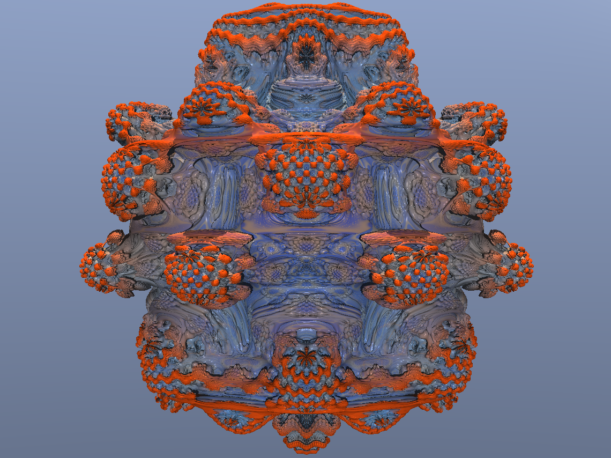
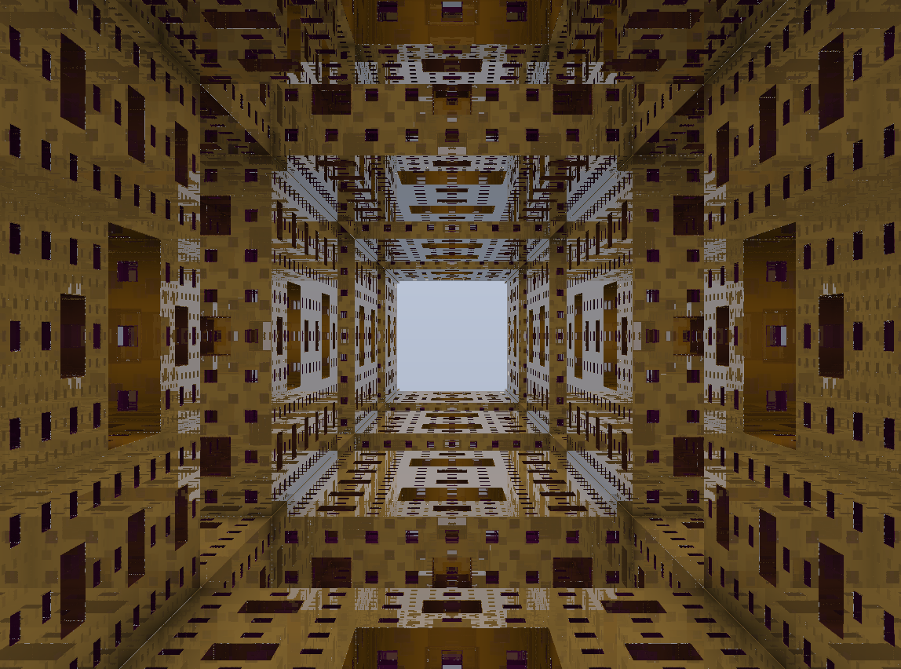
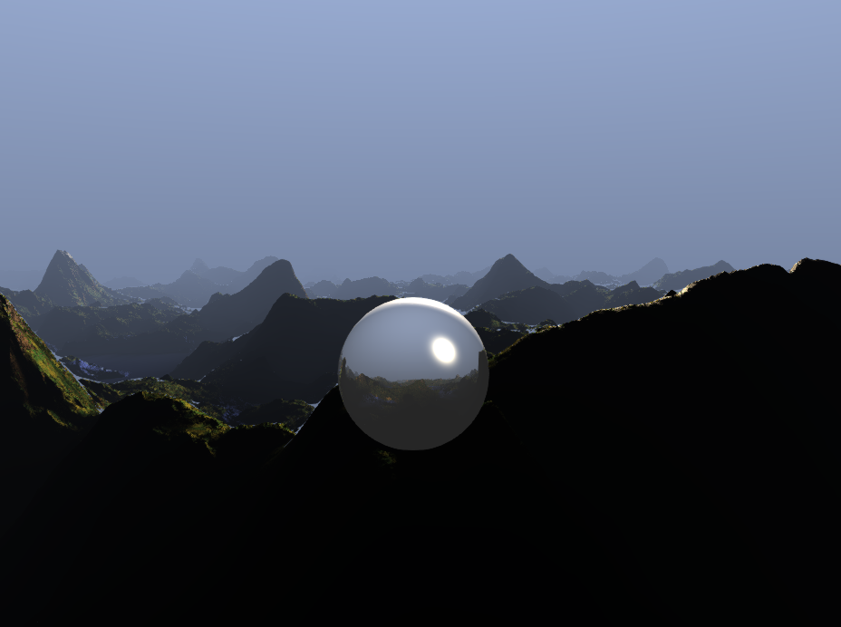
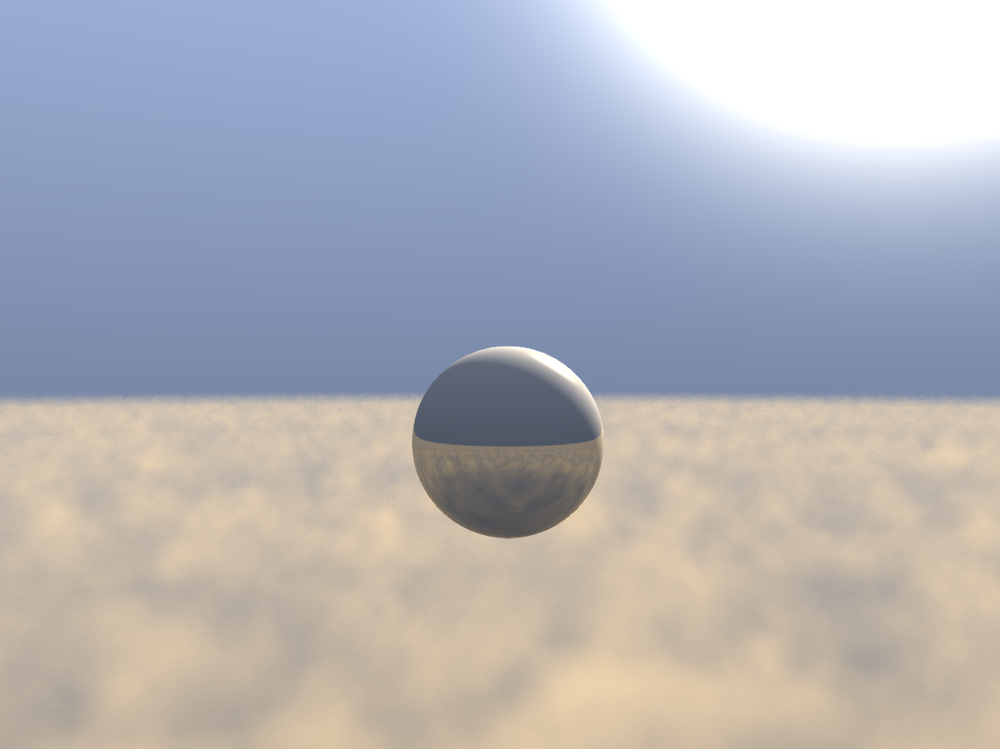
- [Getting Started](#getting-started)
  - [Raymarching Algorithm](#raymarching-algorithm)
- [Raymarcher Implementation](#raymarcher-implementation)
  - [Simple SDFs](#simple-sdfs)
  - [Soft Shadow](#soft-shadow)
  - [Reflection and Refraction](#reflection-and-refraction)
  - [Ambient Occulusion](#ambient-occulusion)
  - [Fast Approximate Anti-Aliasing](#fast-approximate-anti-aliasing)
  - [Sky Box](#sky-box)
  - [Area Lights](#area-lights)
  - [High Dynamic Range](#high-dynamic-range-hdr)
  - [Bloom](#bloom)
- [Fractal Generation](#fractal-generation)
  - [Mandelbrot Set](#mandelbrot-set)
  - [Mandelbulb](#mandelbulb)
  - [Julia Set](#julia-set)
  - [Menger Sponge](#menger-sponge)
- [Procedural Rendering](#procedural-rendering)
  - [Terrain](#terrain)
- [Volumetric Rendering](#volumetric-rendering)
  - [Clouds](#clouds)

# Getting Started

## Raymarching Algorithm

- Ray marching is a technique used in computer graphics, particularly in the context of **ray tracing** and **volume rendering**. It's a method for rendering 3D scenes by simulating the path of rays of light as they travel through a scene.
- In traditional ray tracing, rays are traced from the camera into the scene, and intersections with surfaces are calculated. Ray marching, on the other hand, is used when dealing with complex or implicit surfaces that cannot be easily represented by explicit equations.
- Instead of finding an explicit intersection point with a surface, the algorithm marches along the ray in small steps, testing for intersection at each step. This involves evaluating a distance function, often called a "**signed distance function**" (SDF), which gives the distance from a point in space to the nearest surface.

    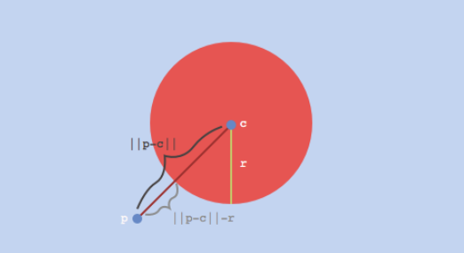

- SDF returns a negative value if we are inside the object. Conversely, it returns a positive value if we are outside
- The algorithm iteratively steps along the ray using the SDF until it finds a point close enough to the surface (i.e., where the SDF value is close to zero). At this point, it considers the ray to have intersected with the surface.

    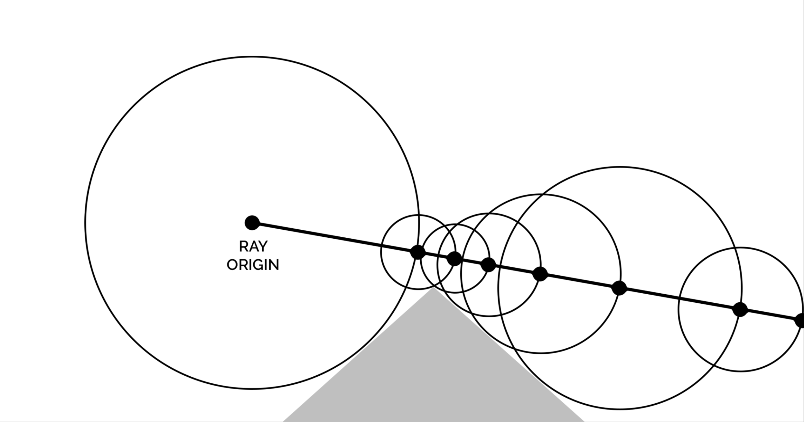

- Once an intersection point is found, shading calculations are performed to determine the final color of the pixel.
- Since each object in the scene is represented as an SDF, raymarching is easily parallelizable!
# Raymarcher Implementation

## Simple SDFs

- Using QtCreator and OpenGL pipeline, we have created a shader that can render simple objects.

|           Sphere SDF            |           Cone SDF            |
| :-----------------------------: | :---------------------------: |
| 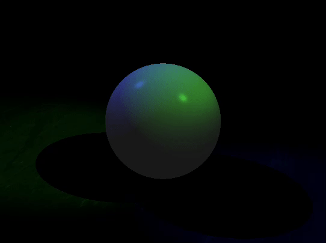 | 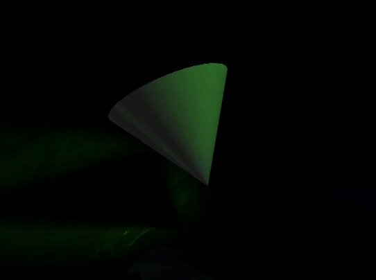 |

|           Cube SDF            |            Cyinder SDF            |
| :---------------------------: | :-------------------------------: |
| 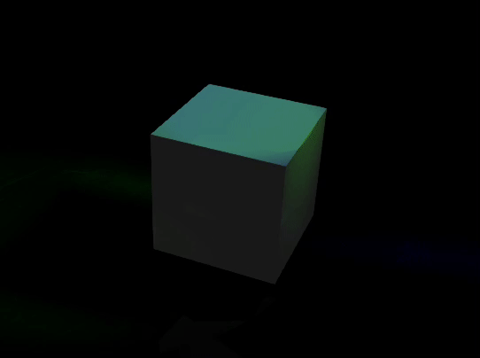 | 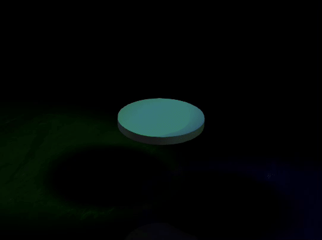 |

|           Torus SDF            |           Capsule SDF            |
| :----------------------------: | :------------------------------: |
| 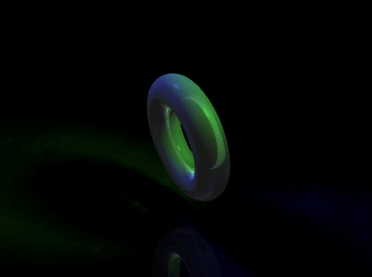 | 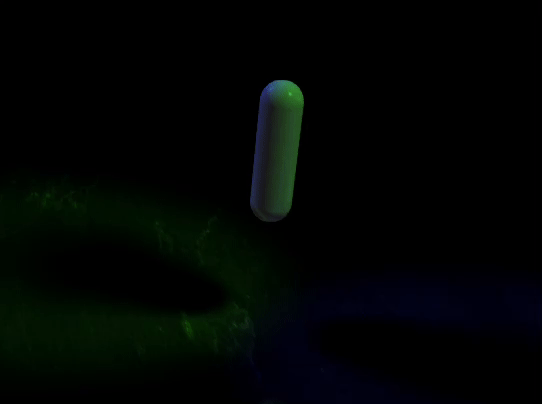 |

|           Hectahedron SDF            |           Deathstar SDF            |
| :----------------------------------: | :--------------------------------: |
| 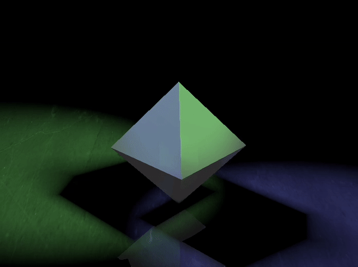 | 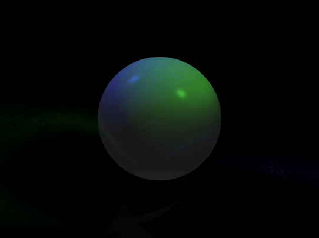 |

## Soft Shadow

- Optionally, you can redner a scene with **soft shadow**. The way it works is instead of shading the shadowed fragments uniformly, we vary the values based on how close the ray is to hitting an object. In other words, if the shadow ray was very close to hitting an object it will have a darker value.
- The way we do this is for each fragment that we want to shade, we march a ray towards the light source $x$ times. If a ray intersects, then the darkness value is scaled based on the distance it marched from the original intersection point

|            Hard Shadow             |            Soft Shadow             |
| :--------------------------------: | :--------------------------------: |
| 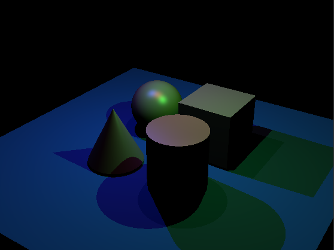 | 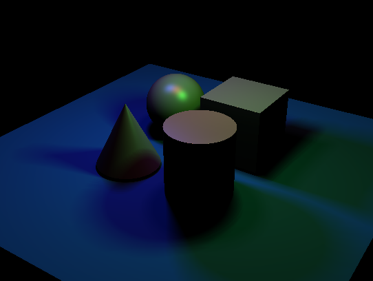 |

## Reflection and Refraction

- Some objects have materials that are inherently reflective or transparent. To reflect that, reflection and refraction are also implemented. Since GLSL does not allow recursive lighting computatoin, the way these are calculated are not strictly correct. Due to time constraints, we decided to stick with a "good enough" answer

|      No Reflection/Refraction       |      With Reflection/Refraction      |
| :---------------------------------: | :----------------------------------: |
| 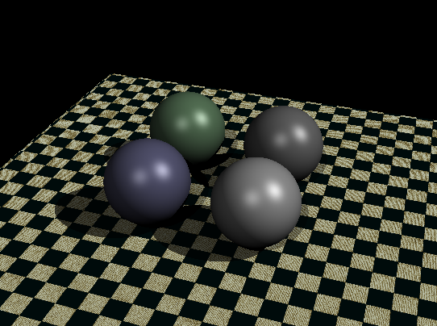 | 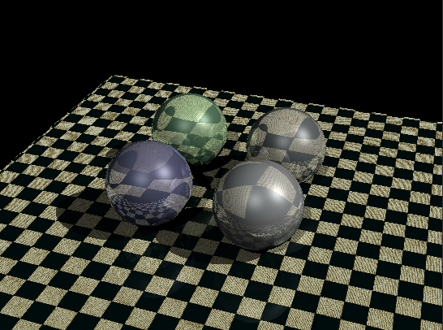 |

## Ambient Occulusion

- Objects that have ambient color will use that value uniformly across all its surfaces. However, if the surface is somewhat hidden by other surfaces, it should appear less bright compared to the less covered surfaces. Ambient Occulusion takes into account this "coveredness" of the surface.
- Pay close attention to the bases of each hectahedrons. The one with Ambient Occulusion is less bright as it is more covered.

|  Without Ambient Occulusion  |    With Ambient Occulusion    |
| :--------------------------: | :---------------------------: |
| 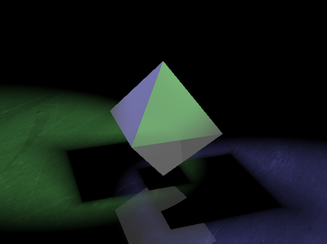 | 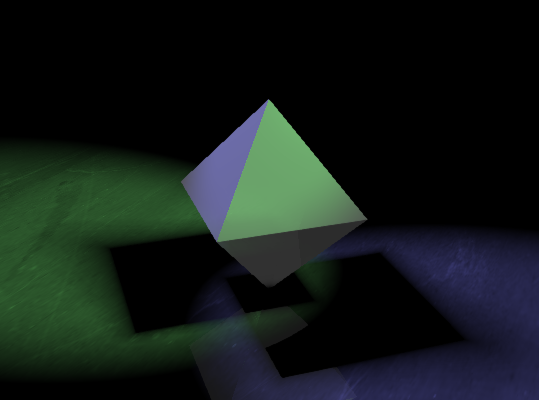 |

## Fast Approximate Anti-Aliasing

- With one ray per output scene pixel, we will have the jaggies due to the finite resolution. FXAA, which is a post-processing technique, aims to provide a fast and efficient way to smooth out these jagged edges, improving the overall visual quality of rendered images.
- If enabled, we render the raymarched texture offline and feed it into the FXAA shader, which in turns evaluates pixel colors and adjusts them based on the analysis of local contrast and edge information.

|                   Without FXAA                    |                     With FXAA                      |
| :-----------------------------------------------: | :------------------------------------------------: |
| 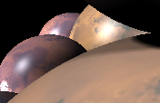 | 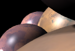 |

## Sky Box

- Using Cube Map, we simulate an external environment. Cube Map is basically a bounding cube with 6 textures (1 for each cube face) that describe the world around you.
- As a POC, we only implemented **static Sky Box**.
- Whenever a ray misses an SDF, we sample from this cube map using the Ray Direction as the uv coordinate.
- Just by this simple trick, and combined with reflection and refraction, we get pretty stunning results.

|            Beach             |            Island             | Night Sky                       |
| :--------------------------: | :---------------------------: | :------------------------------ |
| 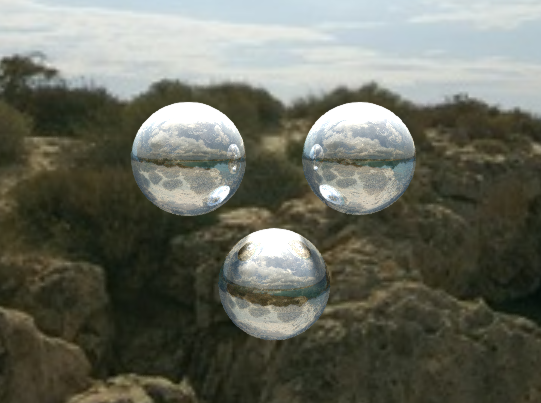 | 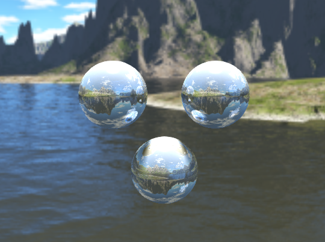 | 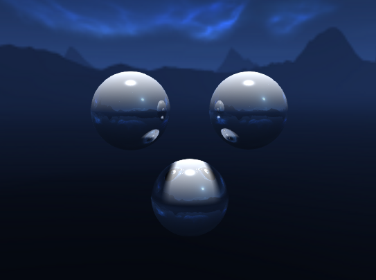 |

## Area Lights

    

- Simple Area Lights implemented based on [this](https://learnopengl.com/Guest-Articles/2022/Area-Lights) amazing guest article.
- For getting shadow effects, we sample configurable number of rays from the rectangle surface of the light source and average their contributions.
- We also note that area light sources themselves need to be rendered into the scene.

    

## High Dynamic Range (HDR)

- In fragment shader, the output color value is clamped to [0, 1] range by default. So what happens if we have a very bright light source (like the sun)? Even when the fragments near the light have different values that are all larger than 1, then all get assigned the clamped value of 1 in the end.
- Using HDR, we render the scene without clamping the color values by using a color attachment with RGBA16F.
- In the second pass, we perform a Reinhard tone mapping.
- Additionally, we test with different exposure values to adjust how much detail we wished to keep

|            No HDR             |      HDR with exposure = 0.5       | HDR with exposure = 0.25            |
| :---------------------------: | :--------------------------------: | :----------------------------------: |
| 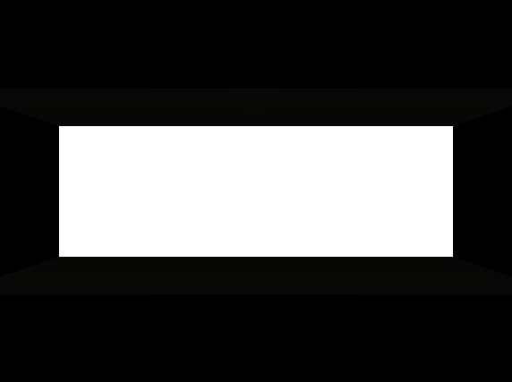 | 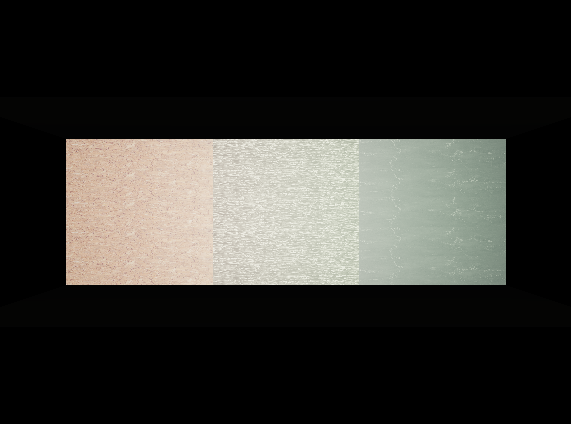 | 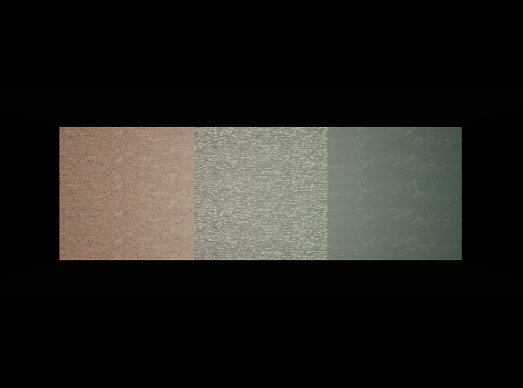 |

## Bloom
- The bloom effect is typically applied to parts of an image that are significantly brighter than their surroundings. When a light source in a scene exceeds a certain intensity threshold, the bloom effect causes light to bleed into surrounding areas, creating a halo or glow around the bright object.
- To achieve this, we attach an additional color buffer to the custom FBO to store fragments that exceed certain color threshold. Then in the second pass, we apply a blur filter on that color buffer to achieve the halo effect. In the final pass, we combine the two color buffers.
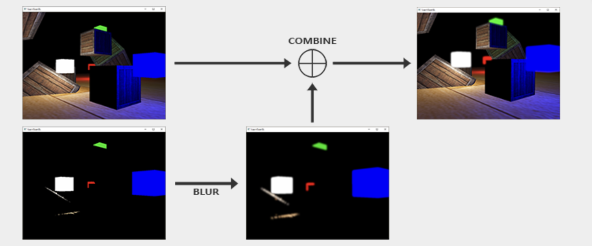
- Combined with Area Lights, we distincly see the visual differences

|  Without Bloom  |    With Bloom    |
| :--------------------------: | :---------------------------: |
| 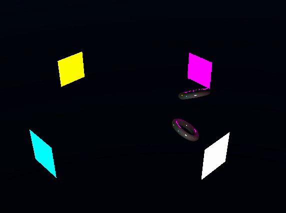 | 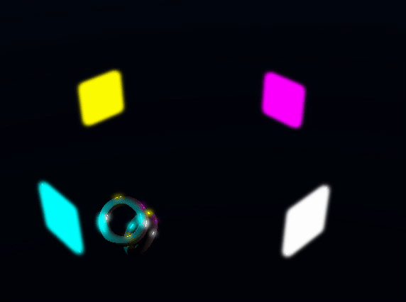 |

# Fractal Generation
- Once we have the basic raymarcher, we can render many interesting objects. Below, we explored different kinds of fractals.

## Mandelbrot set
- The Mandelbrot set is a set of points in a complex plane that has a particular property. It is defined by iterating a simple mathematical formula on each point in the complex plane and determining whether the result remains bounded or not.
- The formula is given by
$$z_{n+1} = z_{n}^{2} + c$$
- In other words, Mandelbrob set is set of all points that does not diverge to infinity as you increase $n$ to infinity. 
- Since we cannot run until infinity, we define the max steps to be $256$ and divergence criteria to be $200$ measured from the center. Rendering this in 2D space, we obtain the below image.

  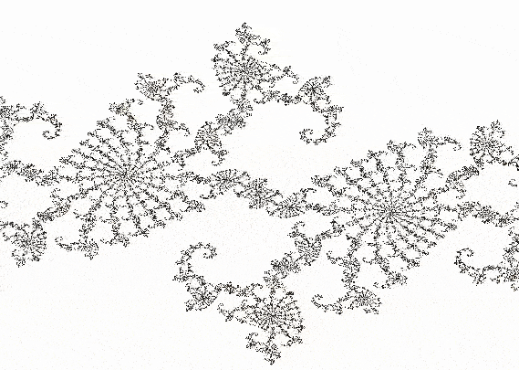

## Mandelbulb
- Mandelbulb is a three-dimensional analogue of the above Mandelbrot set. 
- The formula for generating points in the Mandelbulb fractal involves iterating a mathematical function (described below) on points in 3D space, and determining whether the resulting values stay within certain bounds or diverge. This process is typically repeated for each ray. For our project, the iteretion count is set to $20$.
- Starting at position $z_{0}$, we obtain the next position $z_{1}$ by solving the below formula for certain value of c.
$$z_{n+1} = z_{n}^{p} + c$$
- For a typical Mandelbulb, $n=8$ and $c=z_{0}$ (like the one at the very top of this file!).
- Below is a gif obtained by incrementing the $p$ from $1$ to $30$. 

  

## Julia Set 
- Julia set is almost the same as Mandelbulb set. The only differece is that Julia sets are generally two-dimensional.
$$z_{n+1}=z_{n}^{2}+c$$
- The $c$ term above is called __Julia seed__ and we experiment with different julia seeds. 
- You can generate random seed from the UI when a fractal is loaded.

| 1 | 2 | 3 |
| :---: | :---: | :---: |
| 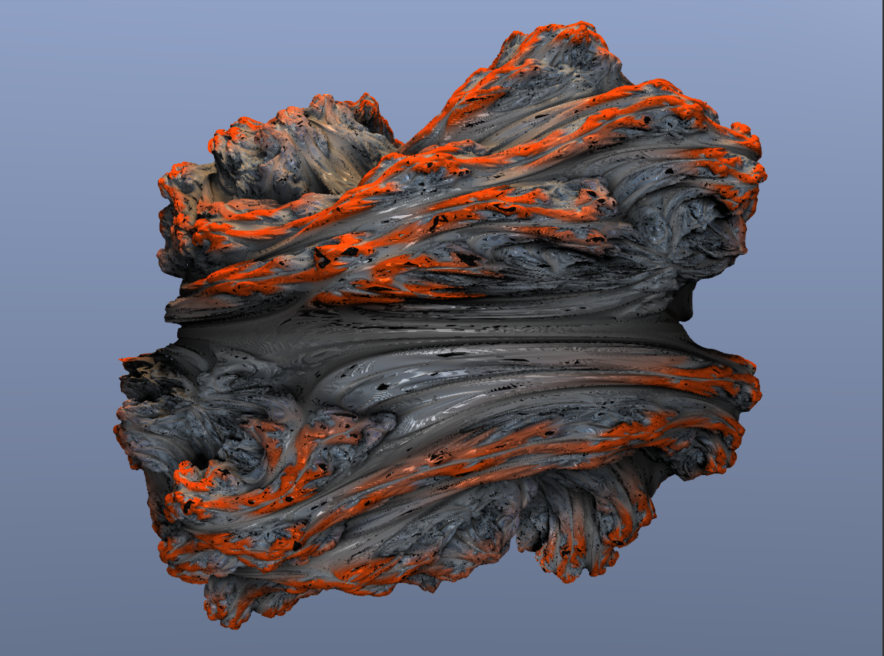 | 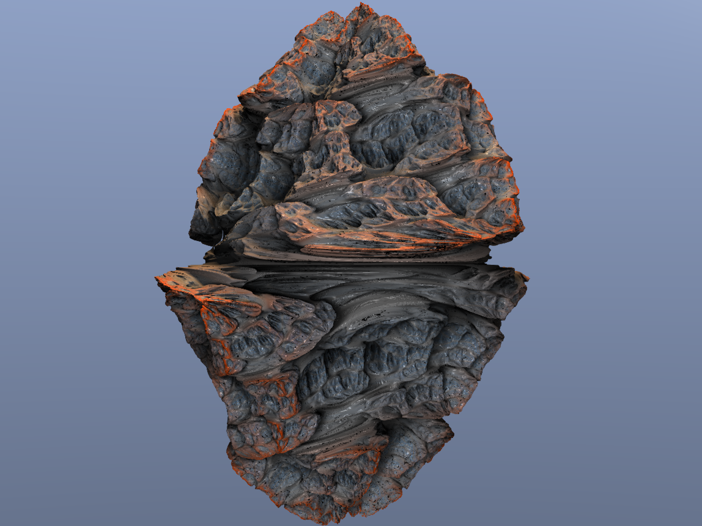 | 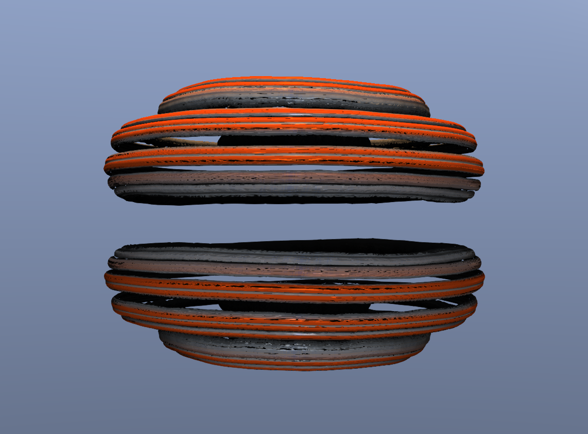 |

## Menger Sponge
- A Menger sponge is a three-dimensional fractal, specifically a sponge-like structure with an infinite surface area and zero volume.
- With SDF, we can simulate a Menger sponge by performing a set of operations on SDFs. 
- Start with a cube. We can then define a cross and subtract the cross from a cube to create a box with cross-shaped hole in it. We can then itereate this process.

| Normal Menger Sponge | Menger Sponge with rotation applied to point p |
| :---: | :---: |
| 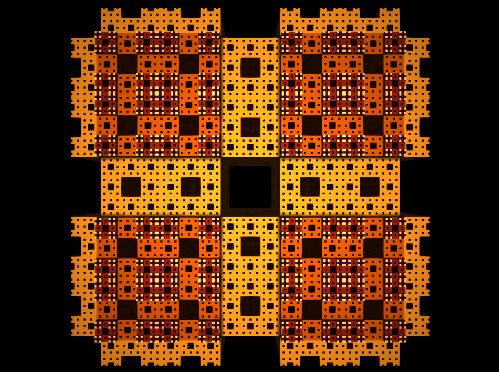 | 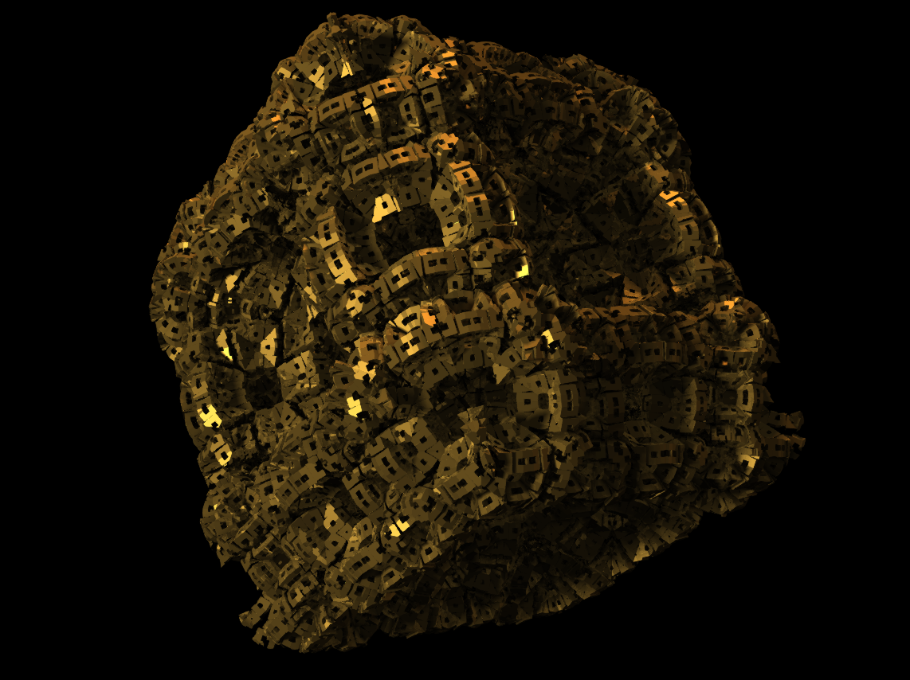 

## Sierpinski Triangle
- Finally, we have Sharpinski Triangle, which we achieved by iteratively folding the space along x, y, and z plane.

  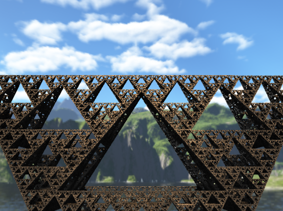

# Procedural Rendering
## Terrain 
- To create organic terrain patterns, our initial attempt used __Fractal Brownian Motion__.
  - FBM composes noises to produce more fine-grained looking results.
  - We start with a simple base noise with initial amplitude and frequency.
  - With each iteration (called an _octave_), we apply the same noise with decreased amplitude and increased the frequency
- This approach of looping however led to sharp decrease in our frame rate as we increased the number of octaves.
- Referring to this [article](https://iquilezles.org/articles/morenoise/), our next attempt was based on a "tweaked" version of FBM. 
  - It samples grayscaled noise texture at various points and interpolate between them.
  - But instead of directly using those values, we use the derivative of them to capture the rate of change
- Below are the naive rendering of terrains

| Octave 4 | Octave 5 |
| :---: | :---: |
| 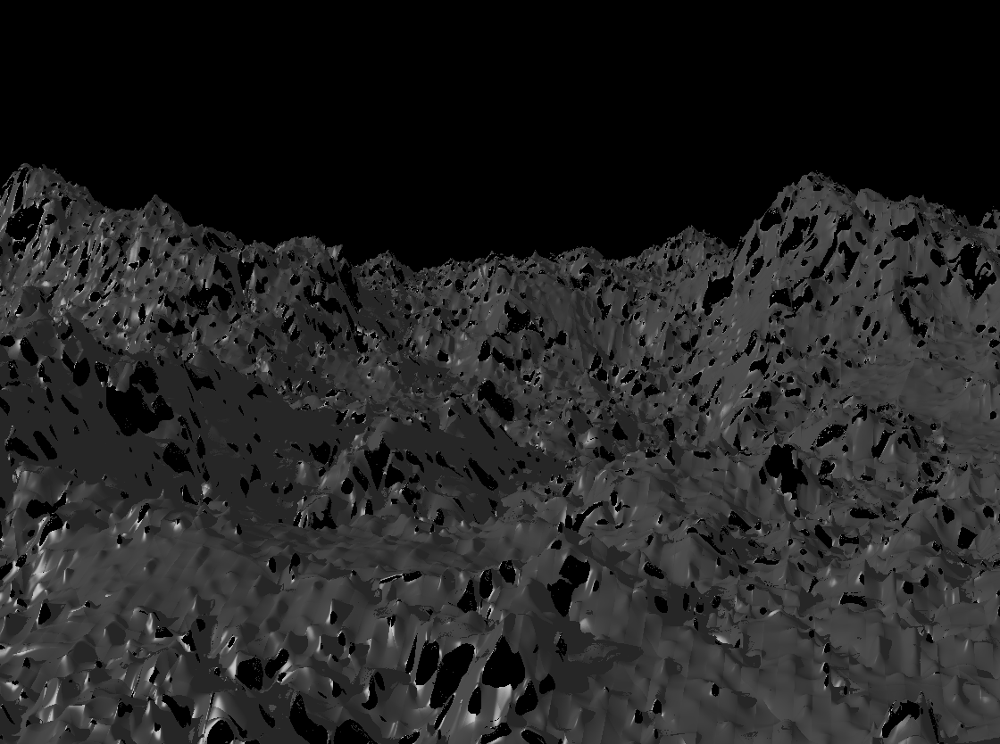 | 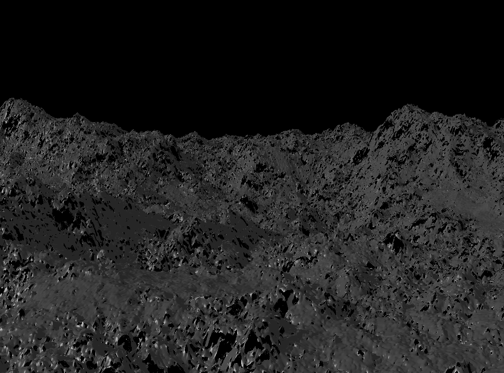 
- We immediately notice that there are black spots in the terrain due to rays overshooting the surface.
- Adding some basic coloring and scaling back the distance ray travels based on the steepness of the terrain, we get the terrain below

  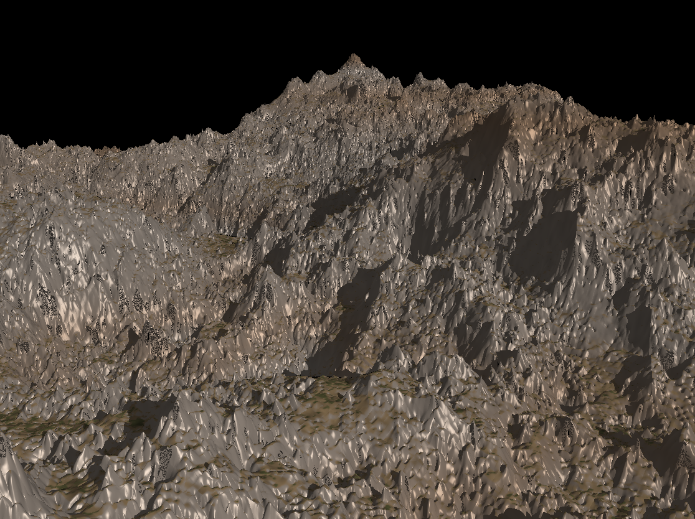

- With fully fledged coloring based on the height of the intersection point and the normal, we get a beautiful scene like the one below

  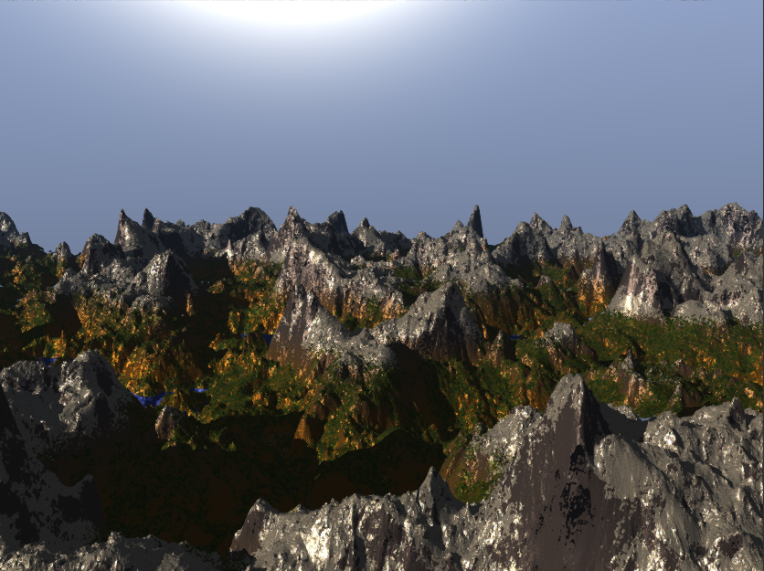

# Volumetric Rendering
- The real strength of raymarching is its ability to render participating media such as fog, smoke, clouds and other volumetric effects.
- To achive this, we shoot a ray normally, but instead of stopping whenever we hit an object, we _march_ through it.

  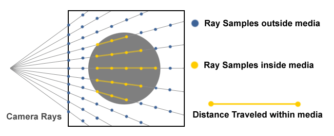

- We then accumulate the sampled values along the ray, taking into account the density and color of the participating medium.

## Cloud
- Using the same noise texture, we can render clouds very easily. 

  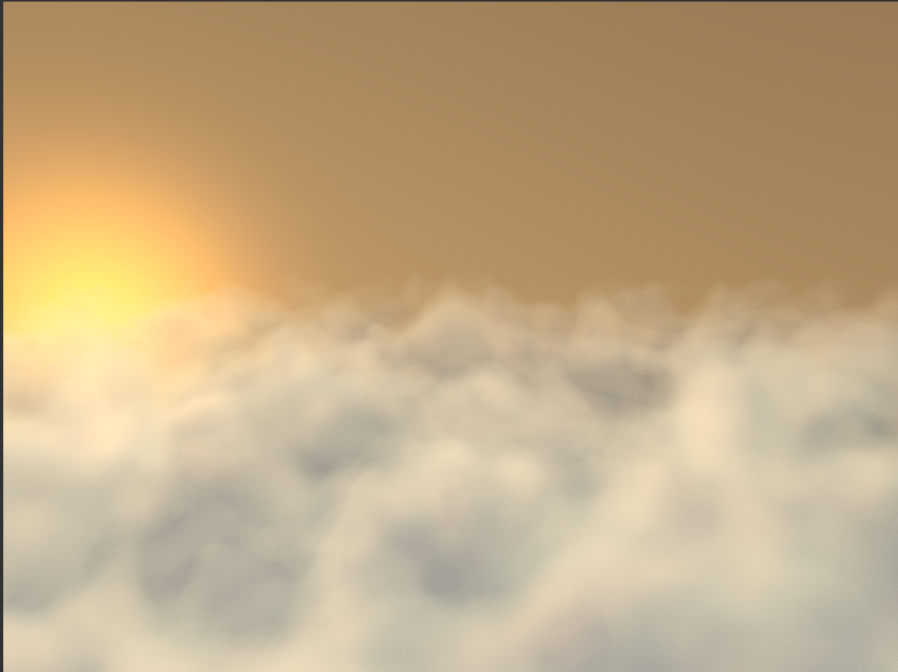

