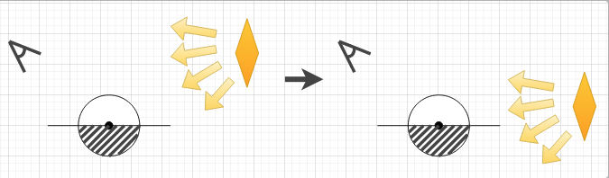

# Project Raymarcher

* [Basic Information](#basic-information)
    * [Raymarching Algorithm](#raymarching-algorithm)
* [Raymarcher Implementation](#raymarcher-implementation)
    * [Simple SDFs](#simple-sdfs)
    * [Soft Shadow](#soft-shadow)
    * [Reflection and Refraction](#reflection-and-refraction)
    * [Ambient Occulusion](#ambient-occulusion)
    * [Fast Approximate Anti-Aliasing](#fast-approximate-anti-aliasing)
    * [Sky Box](#sky-box)
    * [Area Lights](#area-lights)
    * [High Dynamic Range](#high-dynamic-range-hdr)
* [Project Proposal](#project-proposal)
    * [Idea](#idea)
    * [Technical Features](#technical-features)
    * [Implementation Steps](#implementation-steps)
* [References](#references)

# Basic Information
## Raymarching Algorithm
- Ray marching is a technique used in computer graphics, particularly in the context of __ray tracing__ and __volume rendering__. It's a method for rendering 3D scenes by simulating the path of rays of light as they travel through a scene.
- In traditional ray tracing, rays are traced from the camera into the scene, and intersections with surfaces are calculated. Ray marching, on the other hand, is used when dealing with complex or implicit surfaces that cannot be easily represented by explicit equations.
- Instead of finding an explicit intersection point with a surface, the algorithm marches along the ray in small steps, testing for intersection at each step. This involves evaluating a distance function, often called a "__signed distance function__" (SDF), which gives the distance from a point in space to the nearest surface.

    

 
 - SDF returns a negative value if we are inside the object. Conversely, it returns a positive value if we are outside
 - The algorithm iteratively steps along the ray using the SDF until it finds a point close enough to the surface (i.e., where the SDF value is close to zero). At this point, it considers the ray to have intersected with the surface.
 - Once an intersection point is found, shading calculations are performed to determine the final color of the pixel.

# Raymarcher Implementation
## Simple SDFs
Using QtCreator and OpenGL pipeline, we have created a shader that can render simple objects. 

Sphere SDF            |  Cone SDF
:-------------------------:|:-------------------------:
  |  

Cube SDF            |  Cyinder SDF
:-------------------------:|:-------------------------:
  |  

Torus SDF            |  Capsule SDF
:-------------------------:|:-------------------------:
  |  

Hectahedron SDF            |  Deathstar SDF
:-------------------------:|:-------------------------:
  |  

## Soft Shadow
- Optionally, you can redner a scene with __soft shadow__. The way it works is instead of shading the shadowed fragments uniformly, we vary the values based on how close the ray is to hitting an object. In other words, if the shadow ray was very close to hitting an object it will have a darker value.

Hard Shadow         |  Soft Shadow
:-------------------------:|:-------------------------:
  |  

## Reflection and Refraction
- Some objects have materials that are inherently reflective or transparent. To reflect that, reflection and refraction are also implemented. Since GLSL does not allow recursive lighting computatoin, the way these are calculated are not strictly correct. Due to time constraints, we decided to stick with a "good enough" answer

No Reflection/Refraction         |  With Reflection/Refraction
:-------------------------:|:-------------------------:
  |  

## Ambient Occulusion
- Objects that have ambient color will use that value uniformly across all its surfaces. However, if the surface is somewhat hidden by other surfaces, it should appear less bright compared to the less covered surfaces. Ambient Occulusion takes into account this "coveredness" of the surface. 
- Pay close attention to the bases of each hectahedrons. The one with Ambient Occulusion is less bright as it is more covered.

Without Ambient Occulusion       |  With Ambient Occulusion
:-------------------------:|:-------------------------:
  |  

## Fast Approximate Anti-Aliasing
- With one ray per output scene pixel, we will have the jaggies due to the finite resolution. FXAA, which is a post-processing technique, aims to provide a fast and efficient way to smooth out these jagged edges, improving the overall visual quality of rendered images.
- If enabled, we render the raymarched texture offline and feed it into the FXAA shader, which in turns evaluates pixel colors and adjusts them based on the analysis of local contrast and edge information.

Without FXAA       |  With FXAA
:-------------------------:|:-------------------------:
  |  

## Sky Box
- Using Cube Map, we simulate an external environment. Cube Map is basically a bounding cube with 6 textures (1 for each cube face) that describe the world around you.
- As a POC, we only implemented __static Sky Box__. 
- Whenever a ray misses an SDF, we sample from this cube map using the Ray Direction as the uv coordinate. 
- Just by this simple trick, and combined with reflection and refraction, we get pretty stunning results.

Beach       |  Island |  Night Sky
:-------------------------:|:-------------------------:|:-------------------------
  |   |  

## Area Lights

- Simple Area Lights implemented based on [this](https://learnopengl.com/Guest-Articles/2022/Area-Lights) amazing guest article. 
- For getting shadow effects, we sample configurable number of rays from the rectangle surface of the light source and average their contributions.
- We also note that area light sources themselves need to be rendered into the scene.

    

## High Dynamic Range (HDR)
- In fragment shader, the output color value is clamped to [0, 1] range by default. So what happens if we have a very bright light source (like the sun)? Even when the fragments near the light have different values that are all larger than 1, then all get assigned the clamped value of 1 in the end.
- Using HDR, we render the scene without clamping the color values by using a color attachment with RGBA16F.
- In the second pass, we perform a Reinhard tone mapping.
- Additionally, we test with different exposure values to adjust how much detail we wished to keep

No HDR       |  HDR with exposure = 0.5 |  HDR with exposure = 0.25
:-------------------------:|:-------------------------:|:-------------------------
  |   |  

## Project Proposal
### __Idea__
Using Raymarching, generating cool scenes with fractals, terrains and other non-implicit objects (clouds, water, etc.) that are produced using procedural generation

### __Technical Features__
- Sign Distance Fields Raymarcher
    - A technique that can be used to generate fully procedural environments entirely from a single fragment shader.
- Fractal Generation
    - Mandlebulb Fractals with user-modifiable parameters (depth, height, etc.)
- Non-implicit Objects Generation
    - Terrain
        - Gradient Noise 
        - Value Noise
    - Water 
    - Clouds
    - Other Fractals (trees, plants, etc.)
- Lighting and Coloring
    - shadows, reflections, refractions
    - ssao

### __Implementation Steps__
1. (Done) Build a CPU Raymarcher
    - (Done) Test with simple primitives such as Cube and Cylinder
2. Generate Mandlebulb Fractals
3. Procedually generate Terrain
4. Procedually generate other non-implicit objects
5. (Bonus) Make it realtime
6. (Bonus) Produce other Fractals

## References
- Raymarching
    - Basics
        - [1](https://iquilezles.org/articles/terrainmarching/
)
        - [2](https://michaelwalczyk.com/blog-ray-marching.html)
        - [3](https://iquilezles.org/articles/nvscene2008/rwwtt.pdf)
        - [4](https://www.youtube.com/watch?v=Cp5WWtMoeKg)
    - List of SDFs
        - [5](https://iquilezles.org/articles/distfunctions/)
- Fractal Generations
    - [6](http://blog.hvidtfeldts.net/index.php/2011/06/distance-estimated-3d-fractals-part-i/)
    - [7](https://iquilezles.org/articles/mandelbulb/)
- Terrain Generations
    - [8](https://iquilezles.org/articles/morenoise/)
- Cloud Generation
    - [9](https://iquilezles.org/articles/dynclouds/)
- Water Terrain Generation
    - [10](https://iquilezles.org/articles/simplewater/)